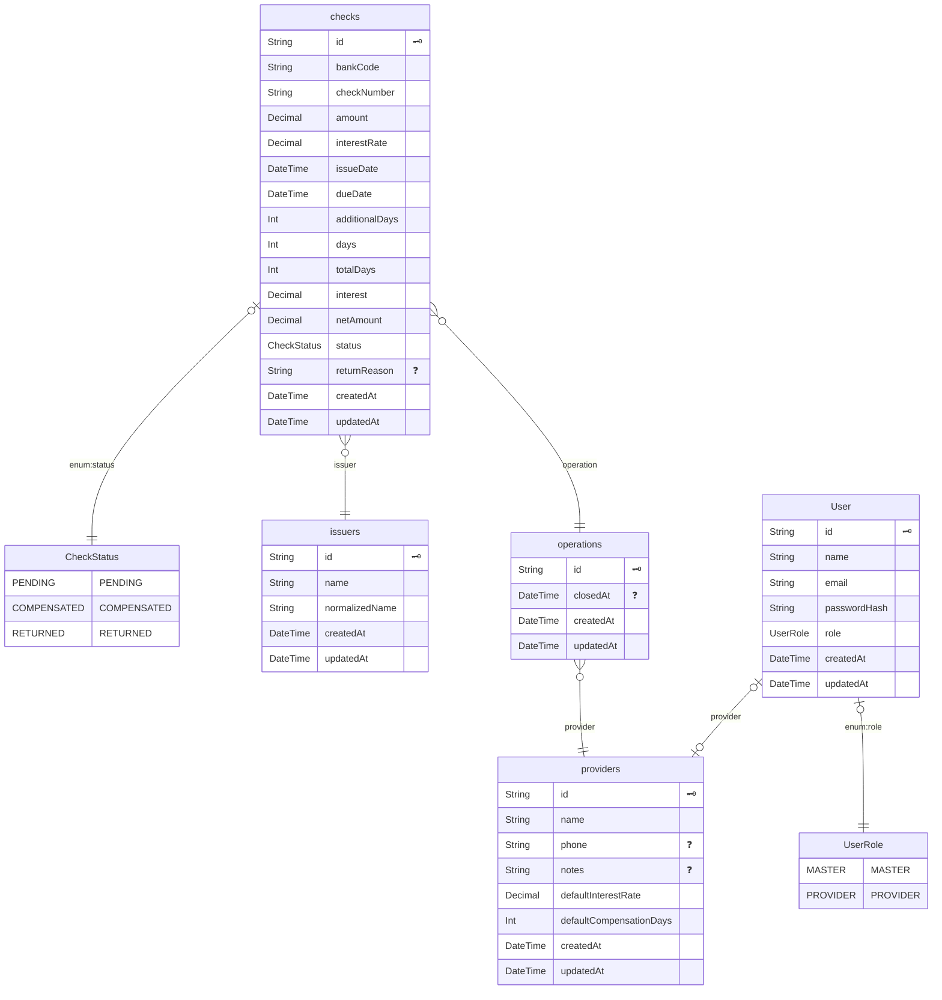

```mermaid
erDiagram

        CheckStatus {
            PENDING PENDING
COMPENSATED COMPENSATED
RETURNED RETURNED
        }
    


        UserRole {
            MASTER MASTER
PROVIDER PROVIDER
        }
    
  "providers" {
    String id "🗝️"
    String name 
    String phone "❓"
    String notes "❓"
    Decimal defaultInterestRate 
    Int defaultCompensationDays 
    DateTime createdAt 
    DateTime updatedAt 
    }
  

  "issuers" {
    String id "🗝️"
    String name 
    String normalizedName 
    DateTime createdAt 
    DateTime updatedAt 
    }
  

  "operations" {
    String id "🗝️"
    DateTime closedAt "❓"
    DateTime createdAt 
    DateTime updatedAt 
    }
  

  "checks" {
    String id "🗝️"
    String bankCode 
    String checkNumber 
    Decimal amount 
    Decimal interestRate 
    DateTime issueDate 
    DateTime dueDate 
    Int additionalDays 
    Int days 
    Int totalDays 
    Decimal interest 
    Decimal netAmount 
    CheckStatus status 
    String returnReason "❓"
    DateTime createdAt 
    DateTime updatedAt 
    }
  

  "User" {
    String id "🗝️"
    String name 
    String email 
    String passwordHash 
    UserRole role 
    DateTime createdAt 
    DateTime updatedAt 
    }
  
    "operations" }o--|| providers : "provider"
    "checks" }o--|| issuers : "issuer"
    "checks" |o--|| "CheckStatus" : "enum:status"
    "checks" }o--|| operations : "operation"
    "User" |o--|| "UserRole" : "enum:role"
    "User" |o--|o providers : "provider"
```
